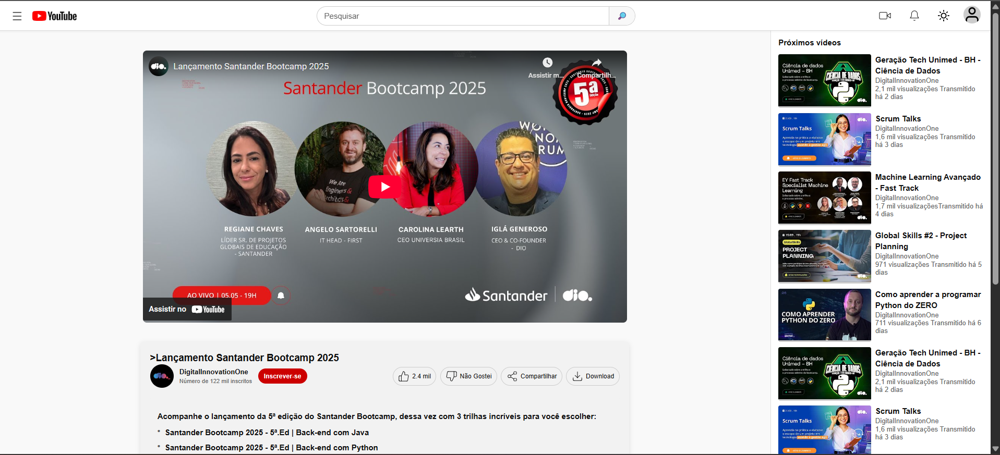
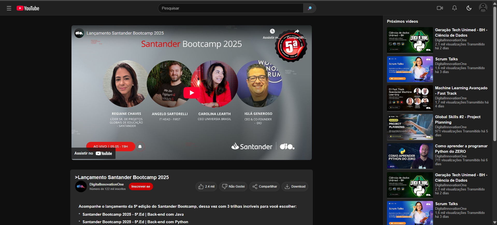

# 🎥 IannTube - Clone do YouTube

> Um clone simplificado e responsivo da interface do YouTube, desenvolvido como parte do desafio da **DIO (Digital Innovation One)** em parceria com o **Santander**.

## 📋 Sobre o Projeto

Este projeto foi criado com foco no desenvolvimento de layouts responsivos utilizando **Flexbox**, proporcionando uma experiência visual similar ao YouTube original. O objetivo principal é demonstrar habilidades em desenvolvimento front-end moderno e técnicas de layout flexível.

### 🎯 Objetivos de Aprendizado

- Dominar o uso do **Flexbox** para layouts responsivos
- Implementar **Design Responsivo** para múltiplos dispositivos
- **JavaScript** apenas para a funcinalidae do DARK MODE.

## 🛠️ Tecnologias Utilizadas

| Tecnologia | Descrição |
|------------|-----------|
| **HTML5** | Estruturação semântica do conteúdo |
| **CSS3** | Estilização e implementação do layout com Flexbox |
| **JavaScript** | Funcionalidade DARK MODE |
| **SVG** | Ícones e logos escaláveis para diferentes resoluções |

## ✨ Funcionalidades

- ✅ **Layout Responsivo** - Adaptável a diferentes tamanhos de tela
- ✅ **Modo Claro/Escuro** - Alternância de temas com persistência
- ✅ **Interface Intuitiva** - Similar ao YouTube original
- ✅ **Ícones Vetoriais** - SVGs otimizados para melhor performance
- ✅ **Navegação Fluida** - Experiência de usuário aprimorada

## 📁 Estrutura do Projeto

```
📦 IannTube/
├── 📁 assets/
│   ├── 📁 icons/
│   │    └── 🖼️ ...                 # Ícones SVG     
│   └── 📁 images/
│       └── 🖼️ ...                 # imagens do projeto
├── 📄 index.html                  # Estrutura principal
├── 🎨 style.css                   # Estilos e layout
├── ⚡ script.js                   # Funcionalidades JavaScript
└── 📖 README.md                   # Documentação
```

## 📚 Principais Aprendizados

### 🔧 Flexbox
- Criação de layouts flexíveis e responsivos
- Ajuste dinâmico de elementos conforme o tamanho da tela
- Alinhamento e distribuição eficiente de componentes

### 🎨 Design Responsivo
- Técnicas para garantir compatibilidade com diversos dispositivos
- Breakpoints estratégicos para diferentes resoluções
- Otimização da experiência do usuário em mobile e desktop

### ⚡ JavaScript Interativo
- Manipulação do DOM para interações dinâmicas
- Implementação de funcionalidades de alternância de tema
- Persistência de preferências do usuário com localStorage

### 🖼️ Trabalho com SVG
- Compreensão das vantagens dos gráficos vetoriais
- Otimização de SVGs para melhor performance
- Controle de cores e estilos através de CSS
- Adaptação de ícones para diferentes temas

## 🌟 Demonstração

### Modo Claro


### Modo Escuro


## 👨‍💻 Autor

**Seu Nome**
- GitHub: [@IannPereira28](https://github.com/IannPereira28)
- LinkedIn: [iann-pereira-dev/](https://linkedin.com/in/iann-pereira-dev/)
- Email: iannpereira20@outlook.com

## 🙏 Agradecimentos

- **DIO (Digital Innovation One)** - Pela oportunidade de aprendizado
- **Santander** - Pela parceria no bootcamp
- **Comunidade Dev** - Pelo suporte e inspiração

---

<div align="center">
  <p>Feito com ❤️ e muito ☕</p>
  <p>⭐ Se este projeto te ajudou, considere dar uma estrela!</p>
</div>
